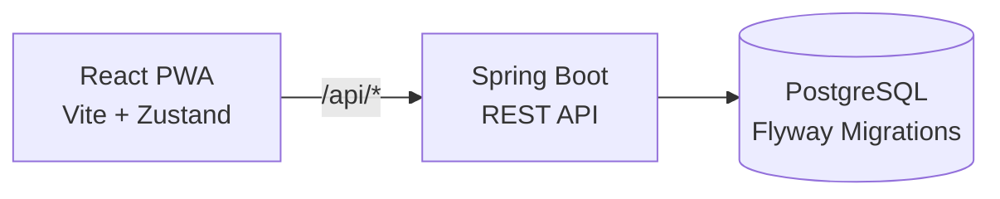

# MyFinance — Personal Financial Advisory Platform

A comprehensive personal finance assessment and advisory application for the Indian market, featuring a 6-step wizard, Progressive Web App (PWA) frontend, and a Spring Boot REST API backend.

## 🚀 Features

- **6-Step Financial Assessment Wizard**
  - Personal Risk Profiling (demographics, risk tolerance)
  - Income & Expense Tracking (cash flow analysis)
  - Assets & Liabilities (net worth calculation)
  - Financial Goal Planning (inflation-adjusted SIP projections)
  - Insurance Gap Analysis (HLV method for life coverage)
  - Tax Optimization (Old vs New regime comparison, India-specific)
- **Interactive Dashboard** — Visual summary of financial health
- **PWA Support** — Offline-capable, installable on mobile devices
- **Swagger UI** — Interactive API documentation

## 🏗 Architecture



## 🛠 Tech Stack

| Layer | Technology |
|---|---|
| Frontend | React 18+, Vite, Tailwind CSS v4, Zustand, TanStack Query |
| Backend | Spring Boot 3.4.2, Java 21, Spring Data JPA |
| Database | PostgreSQL 14+, Flyway migrations |
| API Docs | springdoc-openapi (Swagger UI) |
| Deployment | Docker, Docker Compose, nginx |

## ⚡ Quick Start

### Option A: Docker (Recommended)

```bash
# Clone and start all services
git clone <repo-url> && cd myFinance
docker-compose up -d
```

| Service | URL |
|---|---|
| Frontend | [http://localhost](http://localhost) |
| API | [http://localhost:8080/api/v1/assessment](http://localhost:8080/api/v1/assessment) |
| Swagger UI | [http://localhost:8080/swagger-ui.html](http://localhost:8080/swagger-ui.html) |
| PostgreSQL | `localhost:5432` (user: `postgres`, pass: `postgres`) |

### Option B: Local Development

#### Prerequisites

| Requirement | Version |
|---|---|
| Node.js | 18+ |
| npm | 9+ |
| Java JDK | 21 |
| Maven | 3.8+ |
| PostgreSQL | 14+ |

#### 1. Database Setup

```bash
createdb -U postgres myfinance
```

#### 2. Backend

```bash
cd server/myfinance-backend
mvn spring-boot:run
```

API starts at `http://localhost:8080`. Flyway auto-runs migrations on startup.

#### 3. Frontend

```bash
npm install
npm run dev
```

App available at `http://localhost:5173`. API proxy configured in `vite.config.js`.

## 🔧 Environment Variables

| Variable | Default | Description |
|---|---|---|
| `SPRING_DATASOURCE_URL` | `jdbc:postgresql://localhost:5432/myfinance` | PostgreSQL JDBC URL |
| `SPRING_DATASOURCE_USERNAME` | `postgres` | Database username |
| `SPRING_DATASOURCE_PASSWORD` | `postgres` | Database password |
| `SPRING_FLYWAY_ENABLED` | `true` | Enable/disable Flyway migrations |
| `SERVER_PORT` | `8080` | Backend server port |

## 📂 Project Structure

```
myFinance/
├── specs/                    # Architecture & business specs
│   ├── business_use_cases.md # Business rules for all 6 screens
│   ├── api_specification.md  # REST API contract
│   ├── database_design.md    # ER diagram & SQL schema
│   └── ...
├── server/myfinance-backend/ # Spring Boot backend
│   ├── Dockerfile
│   └── src/main/
├── src/                      # React frontend
│   ├── pages/                # Step1–Step6 wizard screens
│   ├── services/             # API client layer
│   └── store/                # Zustand state management
├── Dockerfile                # Frontend Docker build
├── docker-compose.yml        # Full-stack orchestration
├── nginx.conf                # Reverse proxy config
└── vite.config.js            # Dev server + API proxy
```

## 📖 Documentation

- [Business Use Cases](specs/business_use_cases.md) — User stories & acceptance criteria for all 6 screens
- [API Specification](specs/api_specification.md) — REST endpoint contract
- [Database Design](specs/database_design.md) — ER diagram & SQL schema
- [Backend Architecture](specs/backend_architecture.md) — Spring Boot design
- [Frontend Specification](specs/frontend_specification.md) — React component guide
- **Swagger UI** — `http://localhost:8080/swagger-ui.html` (when backend is running)

## 🤝 Contributing

1. Fork the repository
2. Create your feature branch (`git checkout -b feature/AmazingFeature`)
3. Commit your changes (`git commit -m 'Add some AmazingFeature'`)
4. Push to the branch (`git push origin feature/AmazingFeature`)
5. Open a Pull Request
