# Database Design: MyFinance

## Overview
This document outlines the PostgreSQL database schema for the MyFinance application based on the actual backend (`Java Spring Boot JPA Entities`) implementation. 

*Note: In the current single-session MVP backend implementation, tables use `BIGINT` (Long) primary keys and do not enforce a `user_id` foreign key. This document reflects the exact entity models present in the backend code.*

## ER Diagram

```mermaid
erDiagram
    PROFILES {
        bigint id PK
        int age
        string city
        string marital_status
        int dependents
        int child_dependents
        string employment_type
        string residency_status
        string risk_tolerance
        int risk_score
        string risk_answers
    }

    INCOMES {
        bigint id PK
        string source_name
        decimal amount
        string frequency
        boolean tax_deducted
        decimal tds_percentage
    }

    EXPENSES {
        bigint id PK
        string category
        decimal amount
        string frequency
        boolean is_essential
    }

    ASSETS {
        bigint id PK
        string asset_type
        string name
        decimal current_value
        decimal allocation_percentage
    }

    LIABILITIES {
        bigint id PK
        string liability_type
        string name
        decimal outstanding_amount
        decimal monthly_emi
        decimal interest_rate
    }

    GOALS {
        bigint id PK
        string goal_type
        string name
        decimal target_amount
        decimal current_cost
        int time_horizon_years
        decimal inflation_rate
    }

    INSURANCE_POLICIES {
        bigint id PK
        string insurance_type
        string policy_name
        decimal coverage_amount
        decimal premium_amount
        string renewal_date
    }
    
    TAX_PLANS {
        bigint id PK
        string selected_regime
        decimal ppf_elss_amount
        decimal epf_vpf_amount
        decimal tuition_fees_amount
        decimal lic_premium_amount
        decimal home_loan_principal
        decimal health_insurance_premium
        decimal parents_health_insurance
        decimal calculated_tax_old
        decimal calculated_tax_new
    }
```



## SQL Schema

```sql
-- Profiles Table (Step 1)
CREATE TABLE profiles (
    id BIGSERIAL PRIMARY KEY,
    age INTEGER,
    city VARCHAR(255),
    marital_status VARCHAR(50), -- SINGLE, MARRIED
    dependents INTEGER,
    child_dependents INTEGER,
    employment_type VARCHAR(50), -- SALARIED, SELF_EMPLOYED
    residency_status VARCHAR(50), -- RESIDENT, NRI
    risk_tolerance VARCHAR(50), -- CONSERVATIVE, MODERATE, AGGRESSIVE
    risk_score INTEGER,
    risk_answers TEXT -- JSON string
);

-- Incomes Table (Step 2)
CREATE TABLE incomes (
    id BIGSERIAL PRIMARY KEY,
    source_name VARCHAR(255),
    amount DOUBLE PRECISION,
    frequency VARCHAR(50), -- MONTHLY, YEARLY, ONE_TIME
    tax_deducted BOOLEAN,
    tds_percentage DOUBLE PRECISION
);

-- Expenses Table (Step 2)
CREATE TABLE expenses (
    id BIGSERIAL PRIMARY KEY,
    category VARCHAR(255),
    amount DOUBLE PRECISION,
    frequency VARCHAR(50), -- MONTHLY, YEARLY
    is_essential BOOLEAN
);

-- Assets Table (Step 3)
CREATE TABLE assets (
    id BIGSERIAL PRIMARY KEY,
    asset_type VARCHAR(50), -- REAL_ESTATE, EQUITY, GOLD, DEBT
    name VARCHAR(255),
    current_value DOUBLE PRECISION,
    allocation_percentage DOUBLE PRECISION
);

-- Liabilities Table (Step 3)
CREATE TABLE liabilities (
    id BIGSERIAL PRIMARY KEY,
    liability_type VARCHAR(50), -- HOME_LOAN, CAR_LOAN, etc.
    name VARCHAR(255),
    outstanding_amount DOUBLE PRECISION,
    monthly_emi DOUBLE PRECISION,
    interest_rate DOUBLE PRECISION
);

-- Financial Goals Table (Step 4)
CREATE TABLE goals (
    id BIGSERIAL PRIMARY KEY,
    goal_type VARCHAR(50), -- HOME, CAR, RETIREMENT, EDUCATION
    name VARCHAR(255),
    target_amount DOUBLE PRECISION,
    current_cost DOUBLE PRECISION,
    time_horizon_years INTEGER,
    inflation_rate DOUBLE PRECISION
);

-- Insurance Coverage Table (Step 5)
CREATE TABLE insurance_policies (
    id BIGSERIAL PRIMARY KEY,
    insurance_type VARCHAR(50), -- LIFE, HEALTH
    policy_name VARCHAR(255),
    coverage_amount DOUBLE PRECISION,
    premium_amount DOUBLE PRECISION,
    renewal_date VARCHAR(255)
);

-- Tax Planning Table (Step 6)
CREATE TABLE tax_plans (
    id BIGSERIAL PRIMARY KEY,
    selected_regime VARCHAR(50), -- OLD, NEW
    ppf_elss_amount DOUBLE PRECISION,
    epf_vpf_amount DOUBLE PRECISION,
    tuition_fees_amount DOUBLE PRECISION,
    lic_premium_amount DOUBLE PRECISION,
    home_loan_principal DOUBLE PRECISION,
    health_insurance_premium DOUBLE PRECISION,
    parents_health_insurance DOUBLE PRECISION,
    calculated_tax_old DOUBLE PRECISION,
    calculated_tax_new DOUBLE PRECISION
);
```
```
